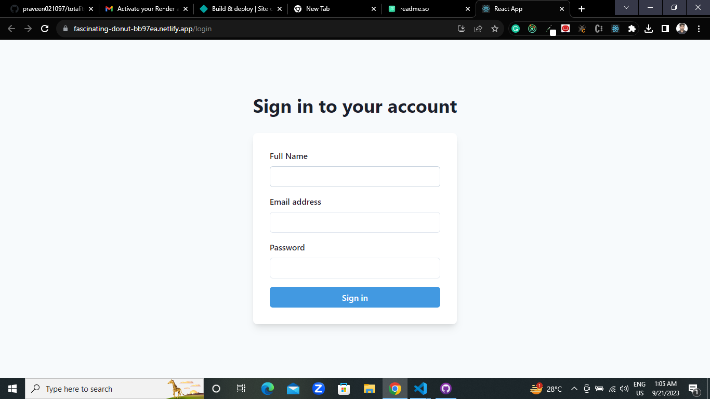
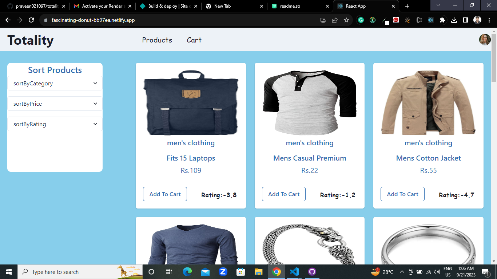
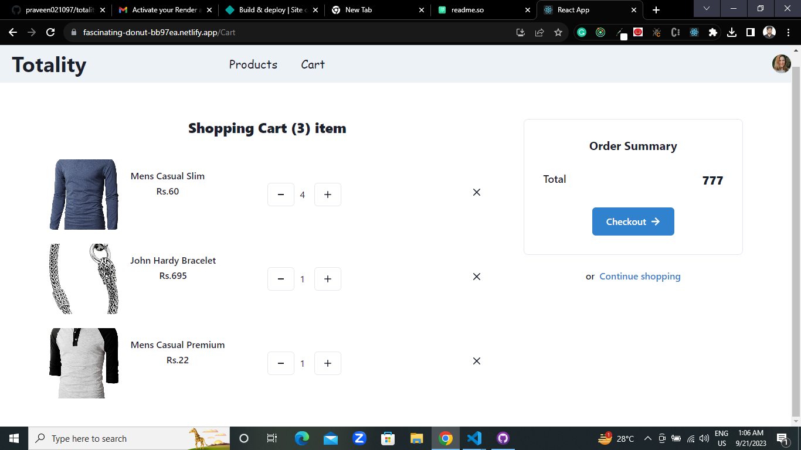
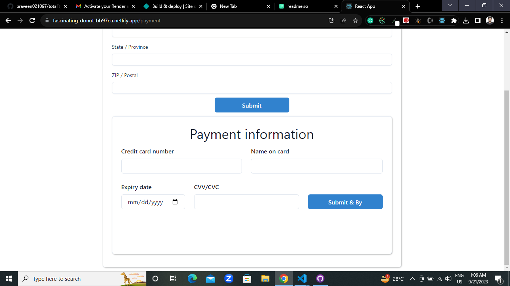

## Totality Frontend Challenge

Basically, it's a Totality Frontend Challenge but it is an intermediate e-commerce web application. I used techStack React, Redux, Chakra ui, and json-server,. json-server was used for development after that I deployed it on render.

##Tech Stack

1. React

2. Redux

3. ChakraUI

4. json-server 

5. TypeScript

## Screenshots
Login

homepage

cart

checkout 

## Deployment Link
deployed on netify:-
https://fascinating-donut-bb97ea.netlify.app
